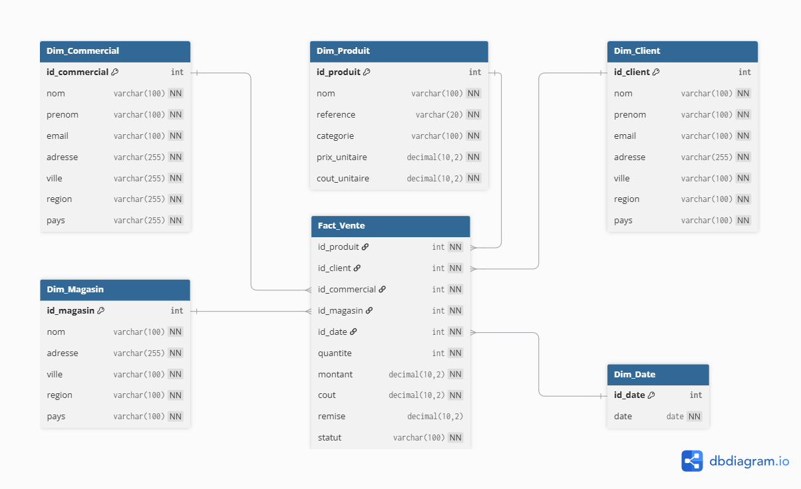
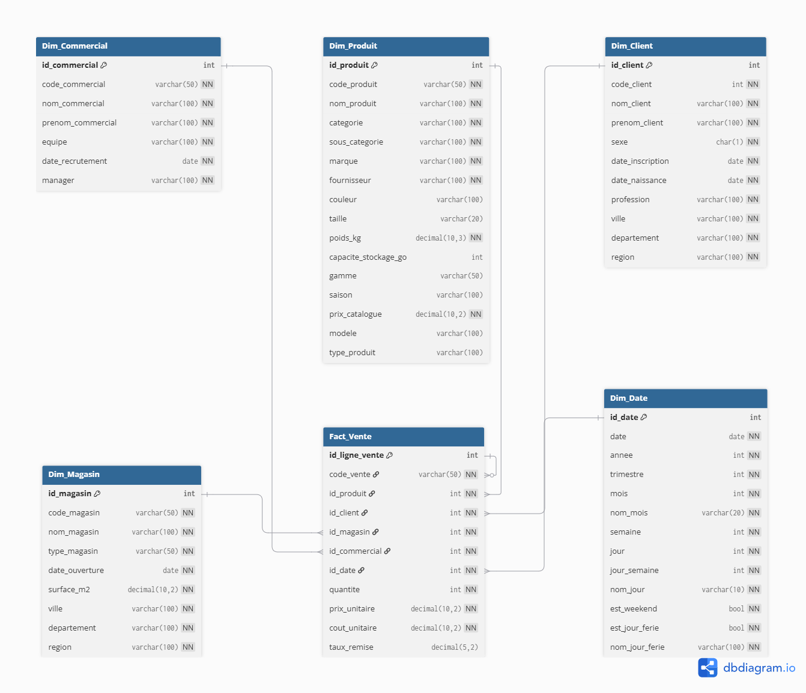

# Design Review – NovaRetail BI

**Version initiale de la revue :** V2 — 11 septembre 2026
**Version actuelle :** V3 — 22 septembre 2026
**Statut :** Validé

---

## Validation

Le modèle a fait l'objet d'une revue de conception afin de valider son adéquation avec les besoins décisionnels du projet.

---

## 1. Contexte

Dans le cadre du projet NovaRetail BI, une première version du modèle de données (V1) a été réalisée afin de représenter les ventes de l'entreprise et de préparer le développement du tableau de bord Power BI.

Une revue de conception a ensuite été organisée afin de valider l'architecture du modèle et de vérifier son adéquation avec les objectifs décisionnels du projet.

---

## 2. Objectif de la revue

L'objectif de cette revue était de s'assurer que le modèle de données était optimisé pour un usage analytique dans Power BI.

Les principaux points étudiés ont été :

* la structure générale du modèle ;
* l'identification de la table de faits ;
* les dimensions nécessaires à l'analyse ;
* les relations entre les tables ;
* l'adéquation du modèle avec un schéma en étoile.

---

## 3. Modèle V1

La première version du modèle était construite selon une logique proche d'un système transactionnel (OLTP).

Elle comportait notamment :

* une table Vente ;
* une table Detail_Vente ;
* plusieurs tables normalisées (Client, Produit, Commercial, Magasin, Catégorie, Localisation, Statut).

Cette conception était adaptée à l'enregistrement des ventes mais nécessitait plusieurs jointures pour réaliser les analyses décisionnelles.

---

## 4. Limites identifiées

Pendant la revue, plusieurs points d'amélioration ont été identifiés :

* navigation complexe entre les tables ;
* modèle davantage orienté transaction que décision ;
* absence de schéma en étoile ;
* dimensions non directement reliées à la table de faits.

---

## 5. Décisions prises

Les décisions suivantes ont été retenues :

* adoption d'un schéma en étoile ;
* création d'une table de faits **Fact_Vente** ;
* rattachement direct des dimensions à la table de faits ;
* intégration des informations géographiques dans les dimensions concernées ;
* suppression des tables intermédiaires devenues inutiles dans un modèle décisionnel.

---

## 6. Modèle V2 – passage au schéma en étoile

Le modèle final est constitué :

### Table de faits

* Fact_Vente

### Dimensions

* Dim_Client
* Dim_Produit
* Dim_Commercial
* Dim_Magasin
* Dim_Date

La table de faits contient les mesures métier :

* quantité ;
* montant ;
* coût ;
* remise ;
* statut.

  

---

## 7. Évolution vers le modèle V3

Après l'implémentation du modèle dans PostgreSQL et la préparation
des données de vente, plusieurs ajustements ont été apportés afin
d'aligner le modèle conceptuel avec le modèle physique.

Les principales évolutions sont :

* ajout de clés métier dans les dimensions :
  `code_produit`, `code_client`, `code_magasin` et `code_commercial` ;
* ajout de `id_ligne_vente` comme clé technique de la table de faits ;
* ajout de `code_vente` pour identifier une transaction métier pouvant
  comporter plusieurs lignes de produits ;
* définition du grain de `Fact_Vente` :
  une ligne représente un produit au sein d'une transaction ;
* conservation de faits atomiques :
  `quantite`, `prix_unitaire`, `cout_unitaire` et `taux_remise` ;
* suppression de `montant` et `cout` en tant que valeurs agrégées
  stockées, ces indicateurs pouvant être calculés à partir des faits
  atomiques ;
* retrait de `statut` du périmètre V1 du dashboard, aucun scénario
  d'annulation ou de retour n'étant modélisé à ce stade.

  

---

## 8. Prochaines étapes

La version V3 du modèle est désormais implémentée dans PostgreSQL
et les données de vente ont été générées et chargées dans la table
`fact_vente`.

Les prochaines étapes du projet portent sur :

* la mise en place des contrôles de qualité des données ;
* la réalisation des requêtes d'analyse SQL ;
* la préparation et la modélisation des données dans Power BI ;
* la création des mesures DAX ;
* la construction du tableau de bord.

## 9. Enseignements tirés de la revue

Cette revue de conception a permis de mettre en évidence les différences entre un modèle transactionnel (OLTP) et un modèle décisionnel (OLAP). Le modèle a été repensé selon une architecture en étoile afin de répondre aux besoins analytiques du projet. Cette étape a renforcé l'importance d'aligner la modélisation des données avec les objectifs métier avant de démarrer le développement.

---

## 10. Décision

La version V3 constitue désormais le modèle de référence du projet
NovaRetail BI.

Elle reflète le schéma effectivement implémenté dans PostgreSQL et
servira de base aux analyses SQL et au modèle Power BI.
